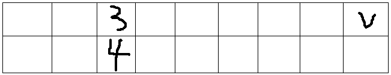
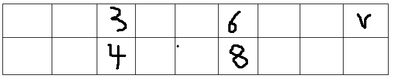
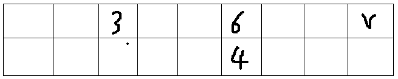
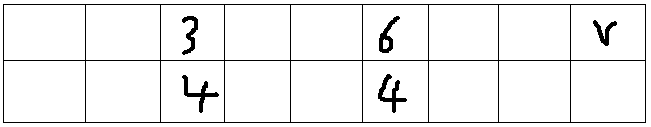

https://blog.csdn.net/yandaoqiusheng/article/details/84782655/
顺序枚举与倒序枚举详细解释
首先说完全背包的正序枚举
假设你现在有一个体积为V VV的背包，有一个体积为3 33，价值为4 44的物品，如果正序枚举的话，等我们填充到3 33这个位置，就会得到价值为4的物品，

等我们在填充到6 66这个位置时，发现还可以造成更大的价值，也就是把这个物品再用一遍

这就是完全背包为什么体积正序枚举的原因
下面说01背包的倒序枚举
题目一样，此时倒序填充背包，为了方便从6 66开始

此时，在体积为6的背包中有了价值为4的物品，但体积为3的背包中物品的价值仍然为0，也就是说填充体积为6的背包只得到了填充体积为3的背包的价值，等再枚举到体积为3的背包时，我们才填充了体积为3的背包，接下来枚举物品是就不会再重复使用这个物品了，所以这个物品只被放了一次，最后的状态是这样的

也就是为什么01背包要倒序枚举的原因。
还没看明白的话，还有一篇更详细的——点这里
